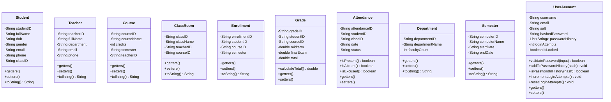

```mermaid
classDiagram
    class Student {
        -String studentID
        -String fullName
        -String dob
        -String gender
        -String email
        -String phone
        -String classID
        +getters()
        +setters()
        +toString() String
    }

    class Teacher {
        -String teacherID
        -String fullName
        -String department
        -String email
        -String phone
        +getters()
        +setters()
        +toString() String
    }

    class Course {
        -String courseID
        -String courseName
        -int credits
        -String semester
        -String teacherID
        +getters()
        +setters()
        +toString() String
    }

    class ClassRoom {
        -String classID
        -String className
        -String teacherID
        -String courseID
        +getters()
        +setters()
        +toString() String
    }

    class Enrollment {
        -String enrollmentID
        -String studentID
        -String courseID
        -String semester
        +getters()
        +setters()
        +toString() String
    }

    class Grade {
        -String gradeID
        -String studentID
        -String courseID
        -double midterm
        -double finalExam
        -double total
        +calculateTotal() double
        +getters()
        +setters()
    }

    class Attendance {
        -String attendanceID
        -String studentID
        -String classID
        -String date
        -String status
        +isPresent() boolean
        +isAbsent() boolean
        +isExcused() boolean
        +getters()
        +setters()
    }

    class Department {
        -String departmentID
        -String departmentName
        -int facultyCount
        +getters()
        +setters()
        +toString() String
    }

    class Semester {
        -String semesterID
        -String semesterName
        -String startDate
        -String endDate
        +getters()
        +setters()
        +toString() String
    }

    class UserAccount {
        -String username
        -String email
        -String salt
        -String hashedPassword
        -List~String~ passwordHistory
        -int loginAttempts
        -boolean isLocked
        +validatePassword(input) boolean
        +addToPasswordHistory(hash) void
        +isPasswordInHistory(hash) boolean
        +incrementLoginAttempts() void
        +resetLoginAttempts() void
        +getters()
        +setters()
    }
```
