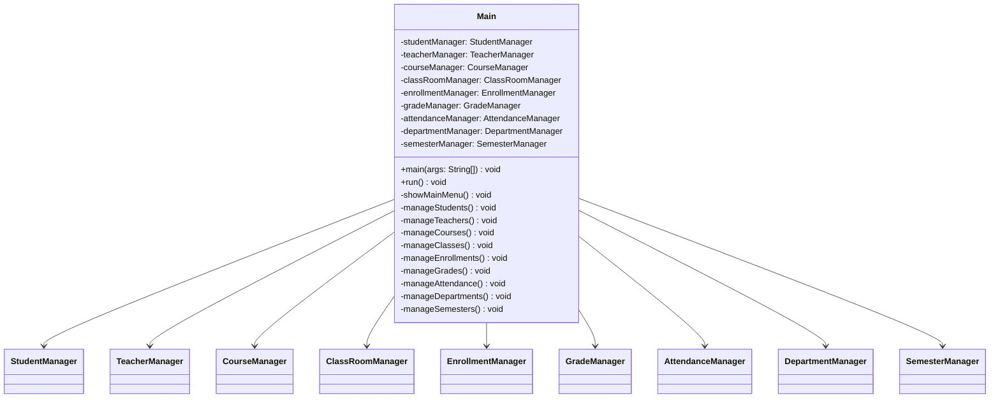

# Class Diagram - Sơ Đồ Lớp

## 1. Tổng quan hệ thống (System Overview)

Hệ thống Quản lý Sinh viên được thiết kế theo mô hình phân lớp đơn giản, bao gồm:
- **MODELS**: Các lớp thực thể chứa dữ liệu.
- **MANAGERS**: Các lớp điều khiển, quản lý logic nghiệp vụ và lưu trữ dữ liệu (vào file .txt).
- **UI**: Giao diện người dùng dòng lệnh (Console).
- **UTILS**: Các công cụ hỗ trợ (như nhập liệu).

## 2. Package MODELS (10 Classes)

```mermaid
classDiagram
    class Person {
        <<abstract>>
        #id: String
        #fullName: String
        #email: String
        #phone: String
        +getId() String
        +setId(String) void
        +getFullName() String
        +setFullName(String) void
        +getEmail() String
        +setEmail(String) void
        +getPhone() String
        +setPhone(String) void
        +toString()* String
    }

    class Student {
        -dob: String
        -gender: String
        -classID: String
        +getDob() String
        +setDob(String) void
        +getGender() String
        +setGender(String) void
        +getClassID() String
        +setClassID(String) void
        +toString() String
    }

    class Teacher {
        -department: String
        +getDepartment() String
        +setDepartment(String) void
        +toString() String
    }

    Person <|-- Student
    Person <|-- Teacher

    class Course {
        -courseID: String
        -courseName: String
        -credits: int
        -semester: String
        -teacherID: String
        +getCourseID() String
        +setCourseID(String) void
        +getCourseName() String
        +setCourseName(String) void
        +getCredits() int
        +setCredits(int) void
        +getSemester() String
        +setSemester(String) void
        +getTeacherID() String
        +setTeacherID(String) void
        +toString() String
    }

    class ClassRoom {
        -classID: String
        -className: String
        -teacherID: String
        -courseID: String
        +getClassID() String
        +setClassID(String) void
        +getClassName() String
        +setClassName(String) void
        +getTeacherID() String
        +setTeacherID(String) void
        +getCourseID() String
        +setCourseID(String) void
        +toString() String
    }

    class Enrollment {
        -enrollmentID: String
        -studentID: String
        -courseID: String
        -semester: String
        +getEnrollmentID() String
        +setEnrollmentID(String) void
        +getStudentID() String
        +setStudentID(String) void
        +getCourseID() String
        +setCourseID(String) void
        +getSemester() String
        +setSemester(String) void
        +toString() String
    }
 
    class Grade {
        -gradeID: String
        -studentID: String
        -courseID: String
        -midterm: double
        -finalExam: double
        -total: double
        +calculateTotal() double
        +getGradeID() String
        +setGradeID(String) void
        +getStudentID() String
        +setStudentID(String) void
        +getCourseID() String
        +setCourseID(String) void
        +getMidterm() double
        +setMidterm(double) void
        +getFinalExam() double
        +setFinalExam(double) void
        +getTotal() double
    }

    class Attendance {
        -attendanceID: String
        -studentID: String
        -classID: String
        -date: String
        -status: String
        +isPresent() boolean
        +isAbsent() boolean
        +isExcused() boolean
        +getAttendanceID() String
        +setAttendanceID(String) void
        +getStudentID() String
        +setStudentID(String) void
        +getClassID() String
        +setClassID(String) void
        +getDate() String
        +setDate(String) void
        +getStatus() String
        +setStatus(String) void
    }

    class Department {
        -departmentID: String
        -departmentName: String
        -facultyCount: int
        +getDepartmentID() String
        +setDepartmentID(String) void
        +getDepartmentName() String
        +setDepartmentName(String) void
        +getFacultyCount() int
        +setFacultyCount(int) void
        +toString() String
    }

    class Semester {
        -semesterID: String
        -semesterName: String
        -startDate: String
        -endDate: String
        +getSemesterID() String
        +setSemesterID(String) void
        +getSemesterName() String
        +setSemesterName(String) void
        +getStartDate() String
        +setStartDate(String) void
        +getEndDate() String
        +setEndDate(String) void
        +toString() String
    }
```

## 3. Package MANAGERS (9 Classes)

```mermaid
classDiagram
    class StudentManager {
        -students: List~Student~
        -FILE_PATH: String
        +addStudent(Student) void
        +updateStudent(String, Student) void
        +deleteStudent(String) void
        +getStudentById(String) Student
        +getAllStudents() List~Student~
        +searchStudents(String) List~Student~
        -loadFromFile() void
        -saveToFile() void
    }

    class TeacherManager {
        -teachers: List~Teacher~
        +add(Teacher) void
        +update(String, Teacher) void
        +delete(String) void
        +getById(String) Teacher
        +getAll() List~Teacher~
        -loadFromFile() void
        -saveToFile() void
    }

    class CourseManager {
        -courses: List~Course~
        +add(Course) void
        +update(String, Course) void
        +delete(String) void
        +getById(String) Course
        +getAll() List~Course~
        -loadFromFile() void
        -saveToFile() void
    }

    class ClassRoomManager {
        -classes: List~ClassRoom~
        +add(ClassRoom) void
        +update(String, ClassRoom) void
        +delete(String) void
        +getById(String) ClassRoom
        +getAll() List~ClassRoom~
        -loadFromFile() void
        -saveToFile() void
    }

    class EnrollmentManager {
        -enrollments: List~Enrollment~
        +add(Enrollment) void
        +update(String, Enrollment) void
        +delete(String) void
        +getById(String) Enrollment
        +getAll() List~Enrollment~
        -loadFromFile() void
        -saveToFile() void
    }

    class GradeManager {
        -grades: List~Grade~
        +add(Grade) void
        +update(String, Grade) void
        +delete(String) void
        +getById(String) Grade
        +getAll() List~Grade~
        -loadFromFile() void
        -saveToFile() void
    }

    class AttendanceManager {
        -attendances: List~Attendance~
        +add(Attendance) void
        +update(String, Attendance) void
        +delete(String) void
        +getById(String) Attendance
        +getAll() List~Attendance~
        -loadFromFile() void
        -saveToFile() void
    }

    class DepartmentManager {
        -departments: List~Department~
        +add(Department) void
        +update(String, Department) void
        +delete(String) void
        +getById(String) Department
        +getAll() List~Department~
        -loadFromFile() void
        -saveToFile() void
    }

    class SemesterManager {
        -semesters: List~Semester~
        +add(Semester) void
        +update(String, Semester) void
        +delete(String) void
        +getById(String) Semester
        +getAll() List~Semester~
        -loadFromFile() void
        -saveToFile() void
    }

    StudentManager ..> Student : manages
    TeacherManager ..> Teacher : manages
    CourseManager ..> Course : manages
    ClassRoomManager ..> ClassRoom : manages
    EnrollmentManager ..> Enrollment : manages
    GradeManager ..> Grade : manages
    AttendanceManager ..> Attendance : manages
    DepartmentManager ..> Department : manages
    SemesterManager ..> Semester : manages
```

## 4. Package UI & Main

