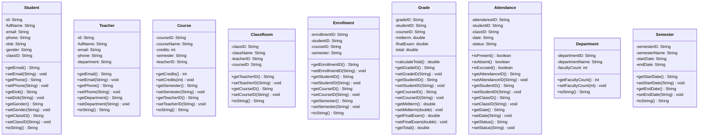

# Class Diagram - Sơ Đồ Lớp

## 1. Package MODELS (12 Classes)

```mermaid
classDiagram


    class Student {
        -id: String
        -fullName: String
        -email: String
        -phone: String
        -dob: String
        -gender: String
        -classID: String
        +getEmail() String
        +setEmail(String) void
        +getPhone() String
        +setPhone(String) void
        +getDob() String
        +setDob(String) void
        +getGender() String
        +setGender(String) void
        +getClassID() String
        +setClassID(String) void
        +toString() String
    }

    class Teacher {
        -id: String
        -fullName: String
        -email: String
        -phone: String
        -department: String
        +getEmail() String
        +setEmail(String) void
        +getPhone() String
        +setPhone(String) void
        +getDepartment() String
        +setDepartment(String) void
        +toString() String
    }


    class Course {
        -courseID: String
        -courseName: String
        -credits: int
        -semester: String
        -teacherID: String
        +getCredits() int
        +setCredits(int) void
        +getSemester() String
        +setSemester(String) void
        +getTeacherID() String
        +setTeacherID(String) void
        +toString() String
    }

    class ClassRoom {
        -classID: String
        -className: String
        -teacherID: String
        -courseID: String
        +getTeacherID() String
        +setTeacherID(String) void
        +getCourseID() String
        +setCourseID(String) void
        +toString() String
    }

    class Enrollment {
        -enrollmentID: String
        -studentID: String
        -courseID: String
        -semester: String
        +getEnrollmentID() String
        +setEnrollmentID(String) void
        +getStudentID() String
        +setStudentID(String) void
        +getCourseID() String
        +setCourseID(String) void
        +getSemester() String
        +setSemester(String) void
        +toString() String
    }
 
    class Grade {
        -gradeID: String
        -studentID: String
        -courseID: String
        -midterm: double
        -finalExam: double
        -total: double
        +calculateTotal() double
        +getGradeID() String
        +setGradeID(String) void
        +getStudentID() String
        +setStudentID(String) void
        +getCourseID() String
        +setCourseID(String) void
        +getMidterm() double
        +setMidterm(double) void
        +getFinalExam() double
        +setFinalExam(double) void
        +getTotal() double
    }

    class Attendance {
        -attendanceID: String
        -studentID: String
        -classID: String
        -date: String
        -status: String
        +isPresent() boolean
        +isAbsent() boolean
        +isExcused() boolean
        +getAttendanceID() String
        +setAttendanceID(String) void
        +getStudentID() String
        +setStudentID(String) void
        +getClassID() String
        +setClassID(String) void
        +getDate() String
        +setDate(String) void
        +getStatus() String
        +setStatus(String) void
    }

    class Department {
        -departmentID: String
        -departmentName: String
        -facultyCount: int
        +getFacultyCount() int
        +setFacultyCount(int) void
        +toString() String
    }

    class Semester {
        -semesterID: String
        -semesterName: String
        -startDate: String
        -endDate: String
        +getStartDate() String
        +setStartDate(String) void
        +getEndDate() String
        +setEndDate(String) void
        +toString() String
    }

   
```
