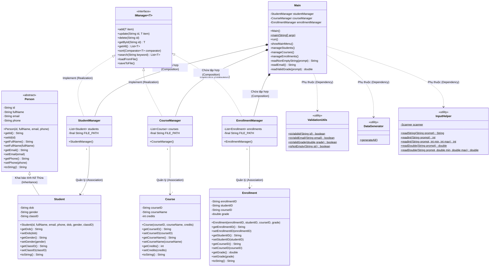

# UML Class Diagram - Hệ Thống Quản Lý Sinh Viên

Biểu đồ dưới đây sử dụng **MermaidJS** để thể hiện cấu trúc Hướng đối tượng của hệ thống sau khi đã tái cấu trúc (Refactor). 
Bạn có thể copy đoạn code dưới đây dán vào [Mermaid Live Editor](https://mermaid.live/) hoặc chèn trực tiếp vào các file Markdown hỗ trợ Mermaid (như GitHub README).

