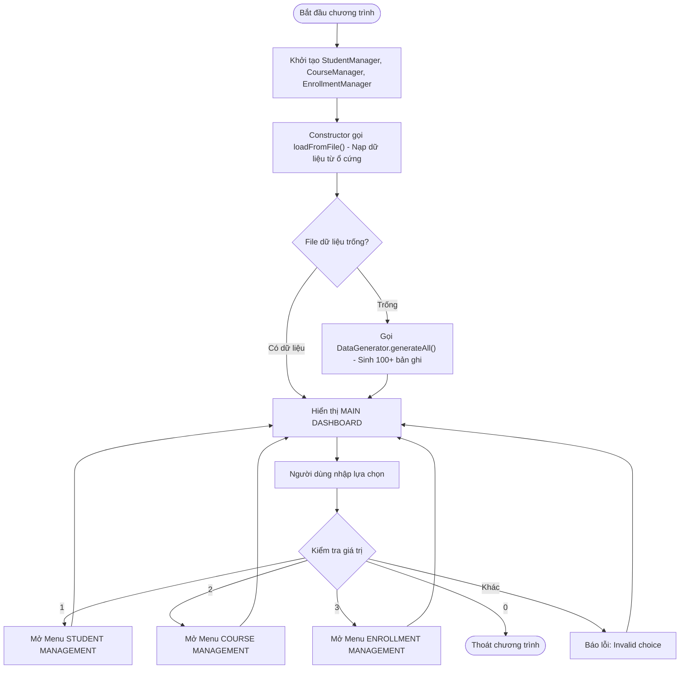
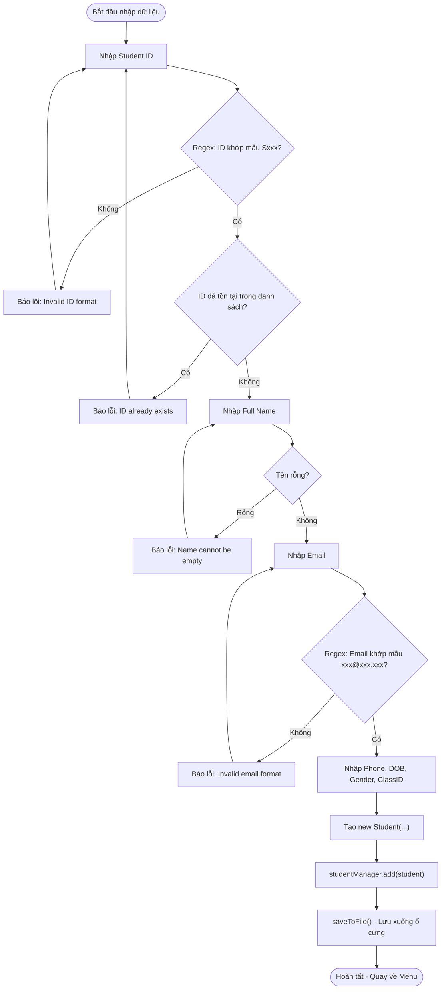
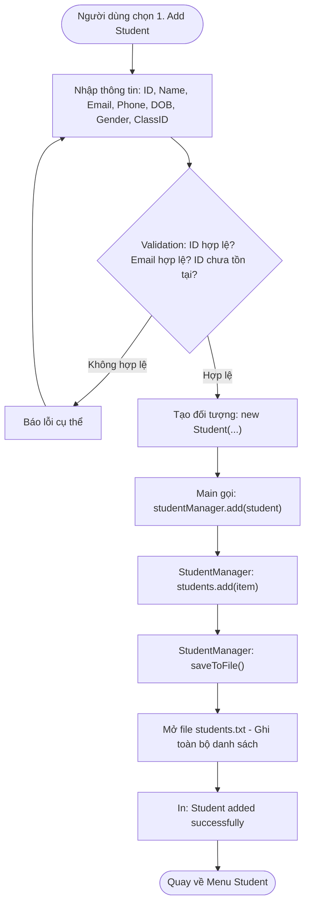
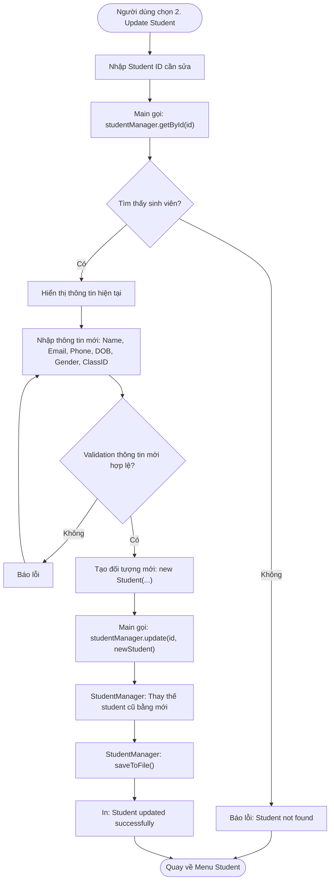
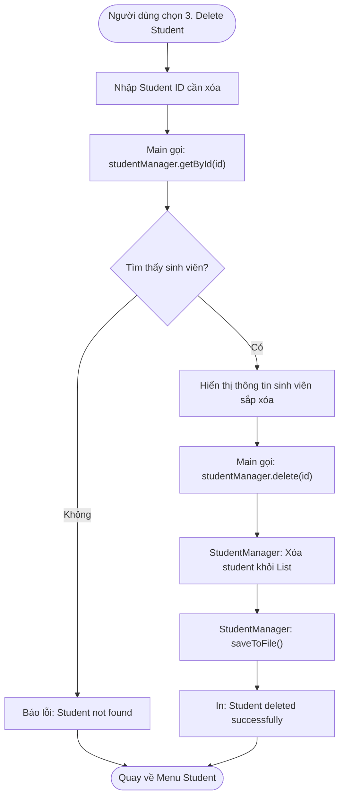
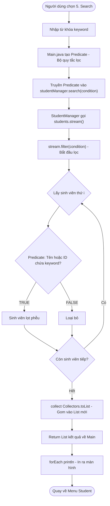
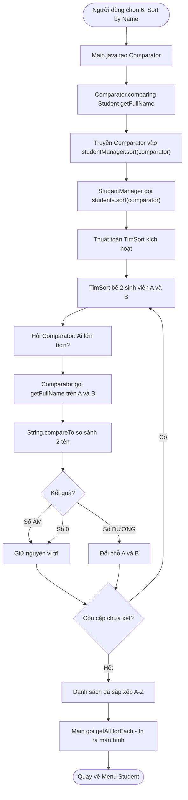

# FINAL FLOWCHARTS - PRO192 Project

> Hướng dẫn: Copy từng đoạn code Mermaid vào https://mermaid.live rồi xuất ra file .png
> Lưu vào thư mục docs/Flowcharts/

---

## 1. Main Menu Flowchart (Đã có MainFlowchart.png)

---

## 2. Validation Flowchart (Luồng kiểm tra dữ liệu)

---

## 3. Add Student Flowchart (Thêm sinh viên)

---

## 4. Update Student Flowchart (Cập nhật sinh viên)

---

## 5. Delete Student Flowchart (Xóa sinh viên)

---

## 6. Search Flowchart (Tìm kiếm - Dùng Predicate)

---

## 7. Sort Flowchart (Sắp xếp - Dùng Comparator)

---

## 8. File I/O Flowchart (loadFromFile + saveToFile)

```mermaid
flowchart TD
    subgraph LOAD["loadFromFile - Đọc file lên RAM"]
        L1(["Bắt đầu loadFromFile"]) --> L2{"File students.txt tồn tại?"}
        L2 -- "Không" --> L3["return - Danh sách rỗng"]
        L2 -- "Có" --> L4["Mở BufferedReader - try-with-resources"]
        L4 --> L5["students.clear - Xóa danh sách cũ"]
        L5 --> L6{"readLine - Đọc 1 dòng"}
        L6 -- "null - Hết file" --> L7["Đóng file tự động"]
        L6 -- "Có dữ liệu" --> L8{"Dòng rỗng?"}
        L8 -- "Rỗng" --> L6
        L8 -- "Có nội dung" --> L9["split dấu phẩy - Chặt thành mảng parts"]
        L9 --> L10{"parts.length >= 7?"}
        L10 -- "Không" --> L6
        L10 -- "Có" --> L11["new Student parts 0 đến parts 6"]
        L11 --> L12["students.add student"]
        L12 --> L6
        L7 --> L13(["Hoàn tất - Dữ liệu đã trên RAM"])
    end

    subgraph SAVE["saveToFile - Ghi từ RAM xuống file"]
        S1(["Bắt đầu saveToFile"]) --> S2["Mở BufferedWriter - try-with-resources"]
        S2 --> S3{"Lấy sinh viên tiếp theo"}
        S3 -- "Hết" --> S4["Đóng file tự động"]
        S3 -- "Có" --> S5["String.format: Nối 7 trường bằng dấu phẩy"]
        S5 --> S6["bw.write dòng text"]
        S6 --> S7["bw.newLine - Xuống dòng"]
        S7 --> S3
        S4 --> S8(["Hoàn tất - Dữ liệu đã trên ổ cứng"])
    end
```

---

## Tóm tắt: Danh sách file PNG cần xuất

| STT | Tên file PNG | Mermaid section |
|---|---|---|
| 1 | MainFlowchart.png | ĐÃ CÓ SẴN |
| 2 | ValidationFlowchart.png | Section 2 |
| 3 | AddStudentFlowchart.png | Section 3 |
| 4 | UpdateStudentFlowchart.png | Section 4 |
| 5 | DeleteStudentFlowchart.png | Section 5 |
| 6 | SearchFlowchart.png | Section 6 |
| 7 | SortFlowchart.png | Section 7 |
| 8 | FileIOFlowchart.png | Section 8 |
