# Flowcharts - Sơ Đồ Luồng Hệ Thống

> **Chú thích hình dạng:**
> - `([...])` = Bắt đầu/Kết thúc
> - `[...]` = Xử lý
> - `{...}` = Điều kiện

---

## 1. Flowchart Tổng Quan Hệ Thống

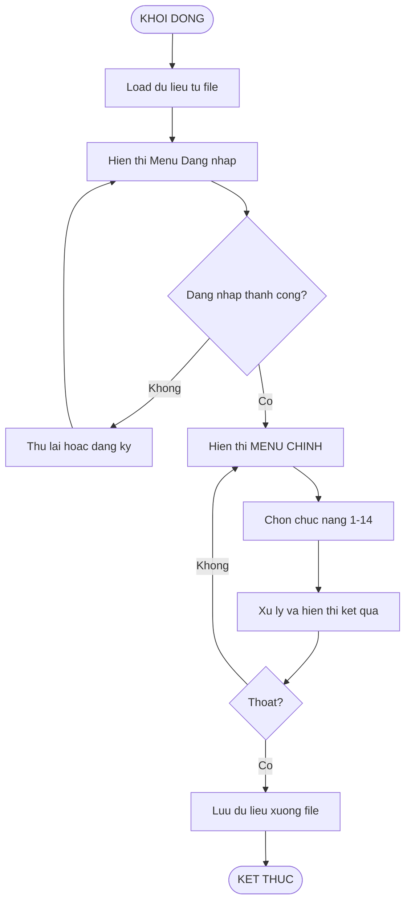
```mermaid
flowchart TD
    A([KHOI DONG]) --> B[Load du lieu tu file]
    B --> C[Hien thi Menu Dang nhap]
    C --> D{Dang nhap thanh cong?}
    D -->|Khong| E[Thu lai hoac dang ky]
    E --> C
    D -->|Co| F[Hien thi MENU CHINH]
    F --> G[Chon chuc nang 1-14]
    G --> H[Xu ly va hien thi ket qua]
    H --> I{Thoat?}
    I -->|Khong| F
    I -->|Co| J[Luu du lieu xuong file]
    J --> K([KET THUC])
```

---

## 2. Flowchart Đăng Nhập

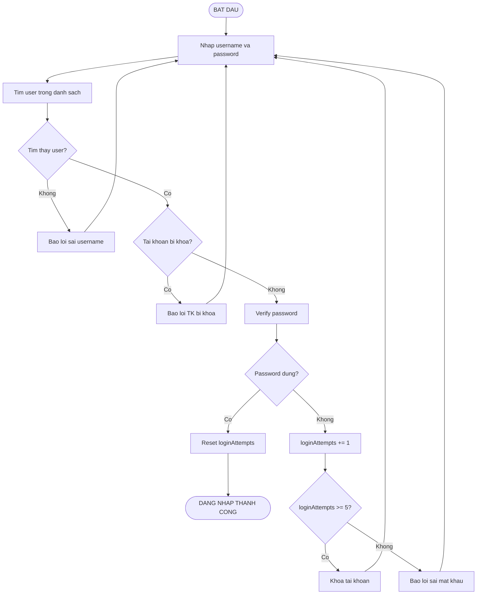
```mermaid
flowchart TD
    A([BAT DAU]) --> B[Nhap username va password]
    B --> C[Tim user trong danh sach]
    C --> D{Tim thay user?}
    D -->|Khong| E[Bao loi sai username]
    E --> B
    D -->|Co| F{Tai khoan bi khoa?}
    F -->|Co| G[Bao loi TK bi khoa]
    G --> B
    F -->|Khong| H[Verify password]
    H --> I{Password dung?}
    I -->|Co| J[Reset loginAttempts]
    J --> K([DANG NHAP THANH CONG])
    I -->|Khong| L[loginAttempts += 1]
    L --> M{loginAttempts >= 5?}
    M -->|Co| N[Khoa tai khoan]
    N --> B
    M -->|Khong| O[Bao loi sai mat khau]
    O --> B
```

---

## 3. Flowchart Đăng Ký Tài Khoản

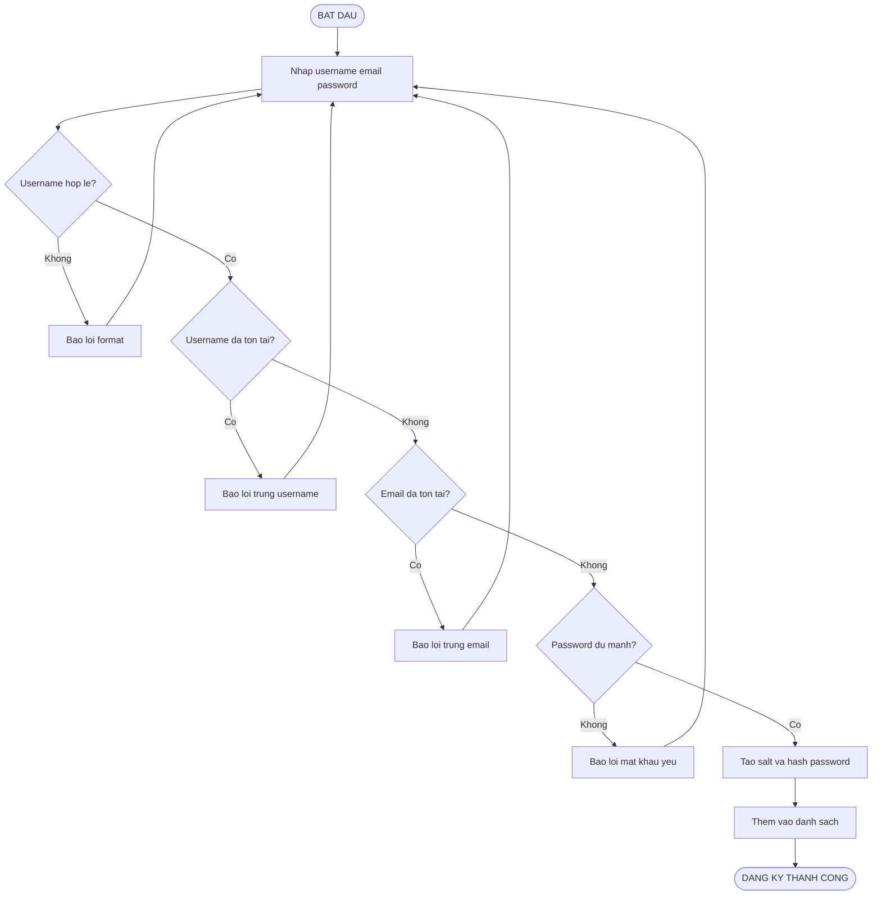
```mermaid
flowchart TD
    A([BAT DAU]) --> B[Nhap username email password]
    B --> C{Username hop le?}
    C -->|Khong| D[Bao loi format]
    D --> B
    C -->|Co| E{Username da ton tai?}
    E -->|Co| F[Bao loi trung username]
    F --> B
    E -->|Khong| G{Email da ton tai?}
    G -->|Co| H[Bao loi trung email]
    H --> B
    G -->|Khong| I{Password du manh?}
    I -->|Khong| J[Bao loi mat khau yeu]
    J --> B
    I -->|Co| K[Tao salt va hash password]
    K --> L[Them vao danh sach]
    L --> M([DANG KY THANH CONG])
```

---

## 4. Flowchart CRUD

### 4.1 Thêm mới - Add

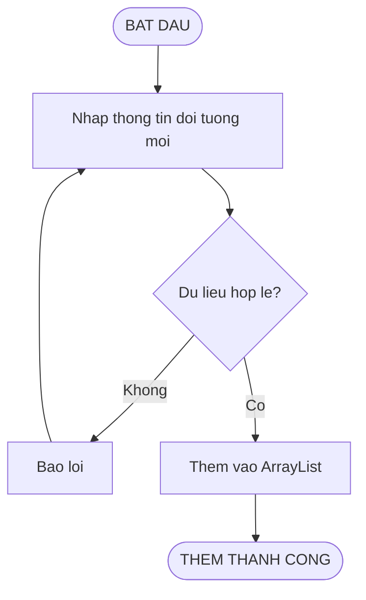
```mermaid
flowchart TD
    A([BAT DAU]) --> B[Nhap thong tin doi tuong moi]
    B --> C{Du lieu hop le?}
    C -->|Khong| D[Bao loi]
    D --> B
    C -->|Co| E[Them vao ArrayList]
    E --> F([THEM THANH CONG])
```

### 4.2 Sửa - Update

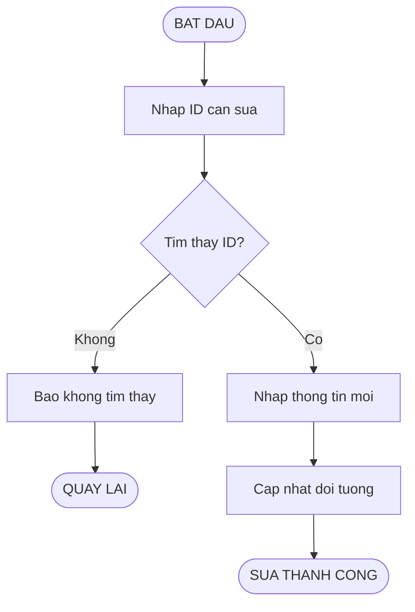
```mermaid
flowchart TD
    A([BAT DAU]) --> B[Nhap ID can sua]
    B --> C{Tim thay ID?}
    C -->|Khong| D[Bao khong tim thay]
    D --> E([QUAY LAI])
    C -->|Co| F[Nhap thong tin moi]
    F --> G[Cap nhat doi tuong]
    G --> H([SUA THANH CONG])
```

### 4.3 Xóa - Delete

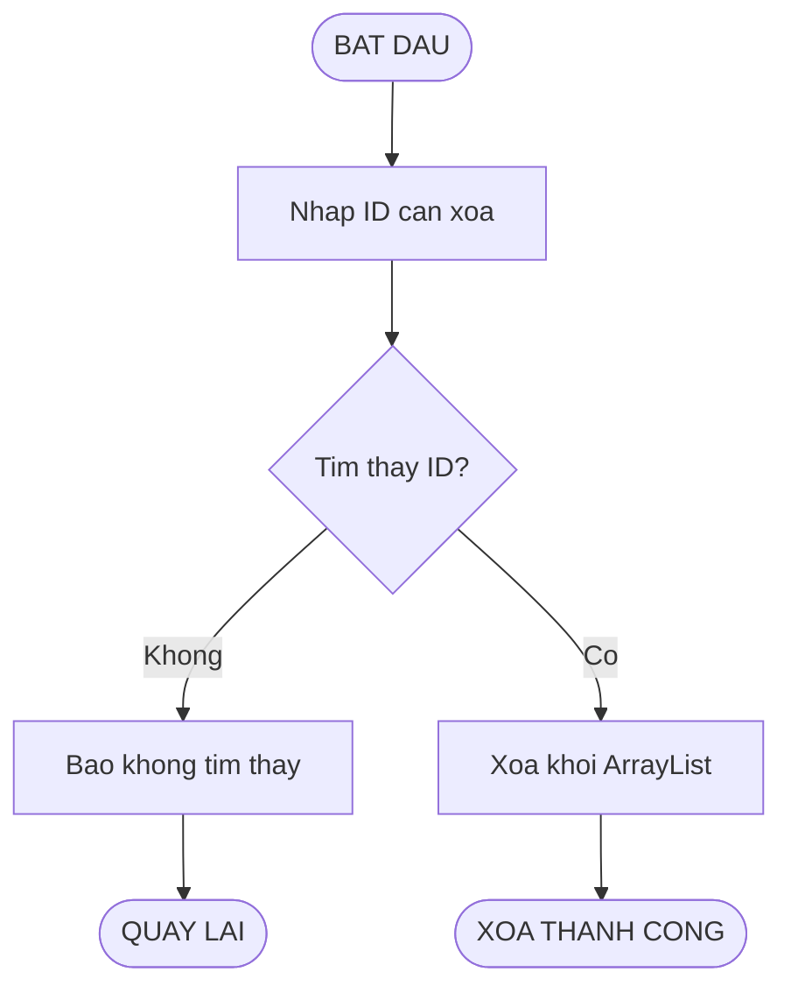
```mermaid
flowchart TD
    A([BAT DAU]) --> B[Nhap ID can xoa]
    B --> C{Tim thay ID?}
    C -->|Khong| D[Bao khong tim thay]
    D --> E([QUAY LAI])
    C -->|Co| F[Xoa khoi ArrayList]
    F --> G([XOA THANH CONG])
```

---

## 5. Flowchart Đổi Mật Khẩu

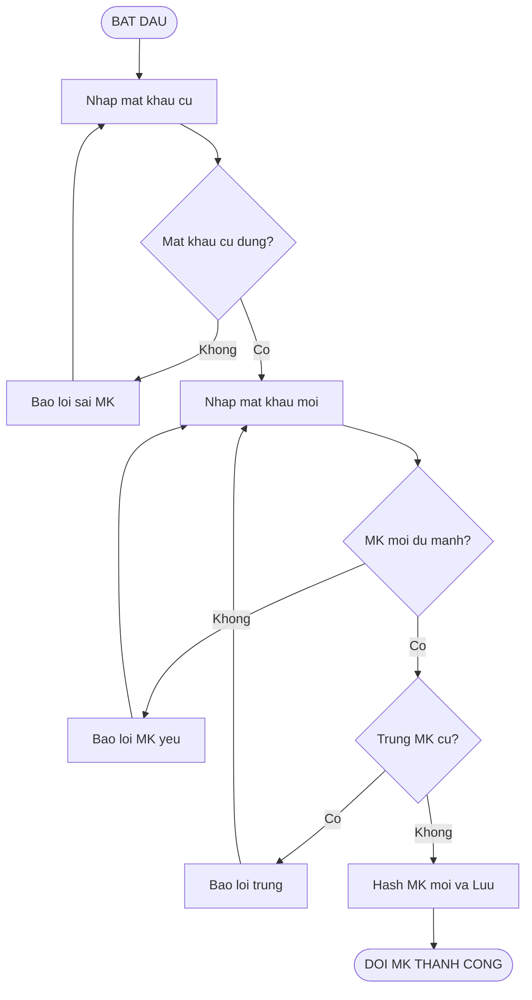
```mermaid
flowchart TD
    A([BAT DAU]) --> B[Nhap mat khau cu]
    B --> C{Mat khau cu dung?}
    C -->|Khong| D[Bao loi sai MK]
    D --> B
    C -->|Co| E[Nhap mat khau moi]
    E --> F{MK moi du manh?}
    F -->|Khong| G[Bao loi MK yeu]
    G --> E
    F -->|Co| H{Trung MK cu?}
    H -->|Co| I[Bao loi trung]
    I --> E
    H -->|Khong| J[Hash MK moi va Luu]
    J --> K([DOI MK THANH CONG])
```

---

## 6. Flowchart Xuất Báo Cáo CSV

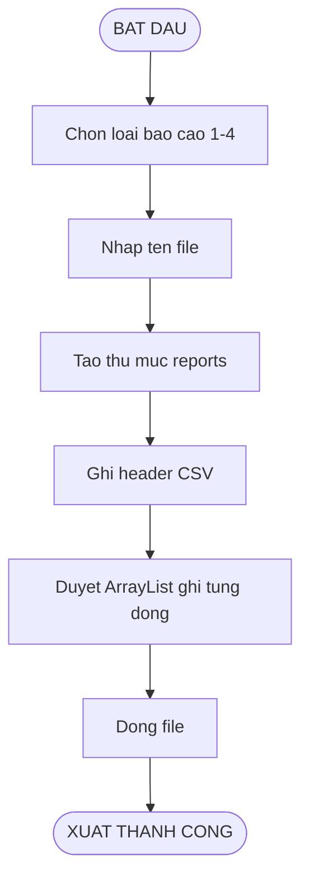
```mermaid
flowchart TD
    A([BAT DAU]) --> B[Chon loai bao cao 1-4]
    B --> C[Nhap ten file]
    C --> D[Tao thu muc reports]
    D --> E[Ghi header CSV]
    E --> F[Duyet ArrayList ghi tung dong]
    F --> G[Dong file]
    G --> H([XUAT THANH CONG])
```

---

## 7. Flowchart Tính Điểm Tổng

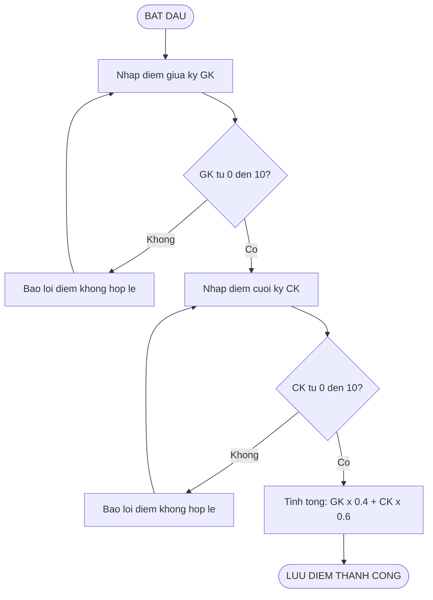
```mermaid
flowchart TD
    A([BAT DAU]) --> B[Nhap diem giua ky GK]
    B --> C{GK tu 0 den 10?}
    C -->|Khong| D[Bao loi diem khong hop le]
    D --> B
    C -->|Co| E[Nhap diem cuoi ky CK]
    E --> F{CK tu 0 den 10?}
    F -->|Khong| G[Bao loi diem khong hop le]
    G --> E
    F -->|Co| H[Tinh tong: GK x 0.4 + CK x 0.6]
    H --> I([LUU DIEM THANH CONG])
```

---

## 8. Flowchart Quản Lý Sinh Viên

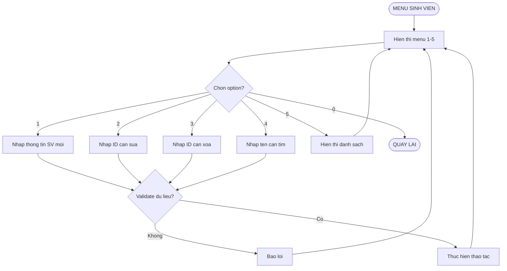
```mermaid
flowchart TD
    A([MENU SINH VIEN]) --> B[Hien thi menu 1-5]
    B --> C{Chon option?}
    C -->|1| D[Nhap thong tin SV moi]
    C -->|2| E[Nhap ID can sua]
    C -->|3| F[Nhap ID can xoa]
    C -->|4| G[Nhap ten can tim]
    C -->|5| H[Hien thi danh sach]
    C -->|0| I([QUAY LAI])
    D --> J{Validate du lieu?}
    E --> J
    F --> J
    G --> J
    H --> B
    J -->|Khong| K[Bao loi]
    K --> B
    J -->|Co| L[Thuc hien thao tac]
    L --> B
```

---

## 9. Flowchart Quản Lý Giảng Viên

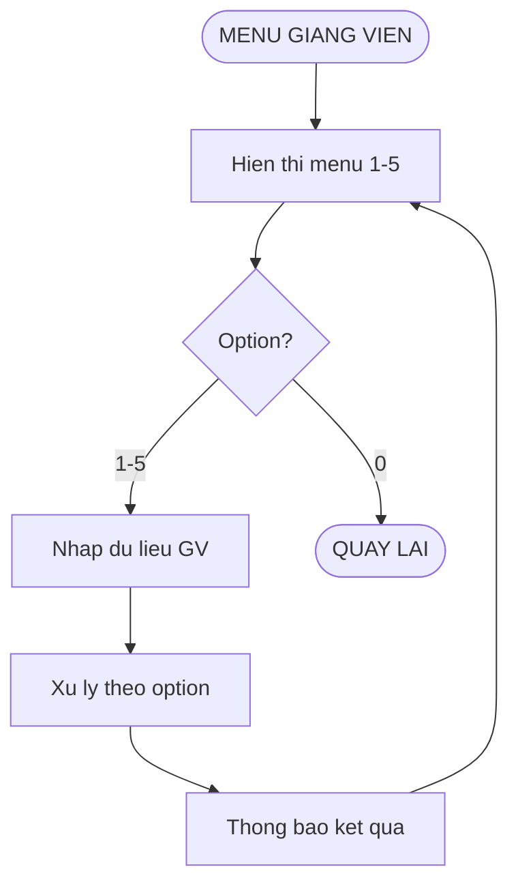
```mermaid
flowchart TD
    A([MENU GIANG VIEN]) --> B[Hien thi menu 1-5]
    B --> C{Option?}
    C -->|1-5| D[Nhap du lieu GV]
    C -->|0| E([QUAY LAI])
    D --> F[Xu ly theo option]
    F --> G[Thong bao ket qua]
    G --> B
```

---

## 10. Flowchart Quản Lý Môn Học

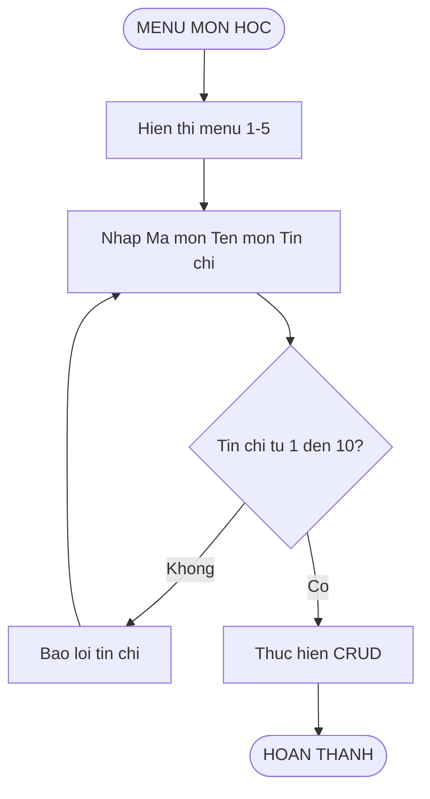
```mermaid
flowchart TD
    A([MENU MON HOC]) --> B[Hien thi menu 1-5]
    B --> C[Nhap Ma mon Ten mon Tin chi]
    C --> D{Tin chi tu 1 den 10?}
    D -->|Khong| E[Bao loi tin chi]
    E --> C
    D -->|Co| F[Thuc hien CRUD]
    F --> G([HOAN THANH])
```

---

## 11. Flowchart Quản Lý Lớp Học

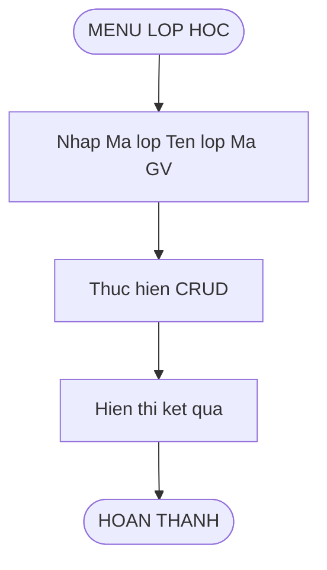
```mermaid
flowchart TD
    A([MENU LOP HOC]) --> B[Nhap Ma lop Ten lop Ma GV]
    B --> C[Thuc hien CRUD]
    C --> D[Hien thi ket qua]
    D --> E([HOAN THANH])
```

---

## 12. Flowchart Quản Lý Đăng Ký Môn

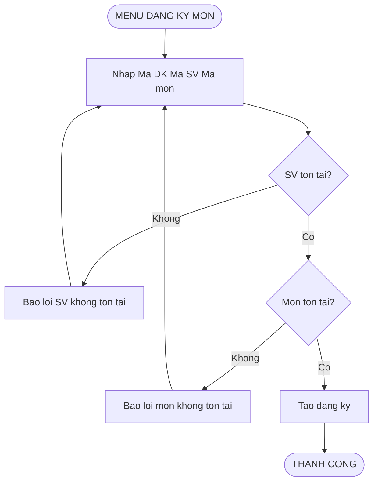
```mermaid
flowchart TD
    A([MENU DANG KY MON]) --> B[Nhap Ma DK Ma SV Ma mon]
    B --> C{SV ton tai?}
    C -->|Khong| D[Bao loi SV khong ton tai]
    D --> B
    C -->|Co| E{Mon ton tai?}
    E -->|Khong| F[Bao loi mon khong ton tai]
    F --> B
    E -->|Co| G[Tao dang ky]
    G --> H([THANH CONG])
```

---

## 13. Flowchart Quản Lý Điểm Danh

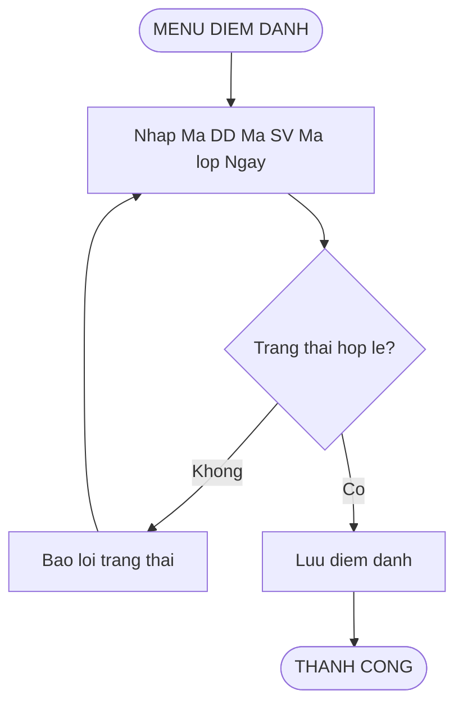
```mermaid
flowchart TD
    A([MENU DIEM DANH]) --> B[Nhap Ma DD Ma SV Ma lop Ngay]
    B --> C{Trang thai hop le?}
    C -->|Khong| D[Bao loi trang thai]
    D --> B
    C -->|Co| E[Luu diem danh]
    E --> F([THANH CONG])
```

---

## 14. Flowchart Quản Lý Khoa

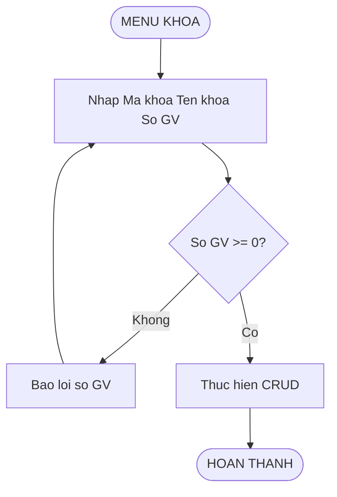
```mermaid
flowchart TD
    A([MENU KHOA]) --> B[Nhap Ma khoa Ten khoa So GV]
    B --> C{So GV >= 0?}
    C -->|Khong| D[Bao loi so GV]
    D --> B
    C -->|Co| E[Thuc hien CRUD]
    E --> F([HOAN THANH])
```

---

## 15. Flowchart Quản Lý Học Kỳ

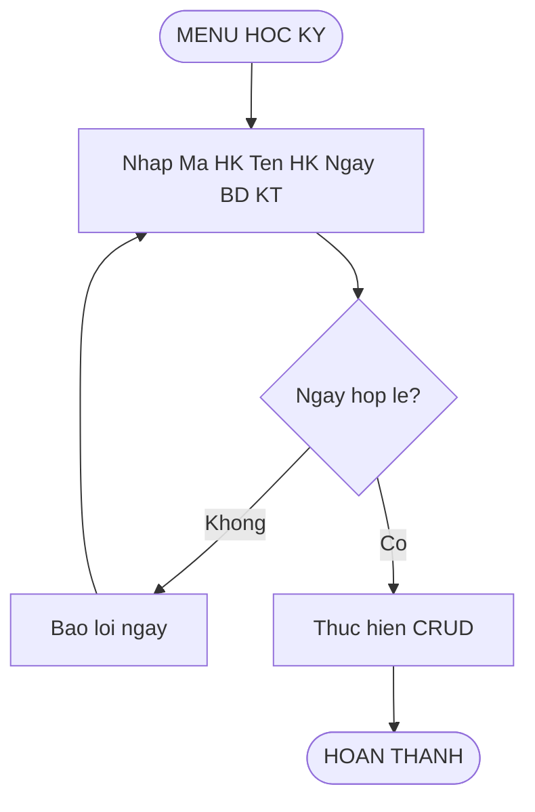
```mermaid
flowchart TD
    A([MENU HOC KY]) --> B[Nhap Ma HK Ten HK Ngay BD KT]
    B --> C{Ngay hop le?}
    C -->|Khong| D[Bao loi ngay]
    D --> B
    C -->|Co| E[Thuc hien CRUD]
    E --> F([HOAN THANH])
```

---

## 16. Flowchart Thống Kê

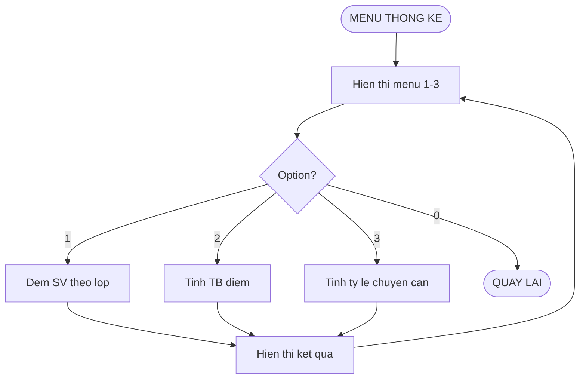
```mermaid
flowchart TD
    A([MENU THONG KE]) --> B[Hien thi menu 1-3]
    B --> C{Option?}
    C -->|1| D[Dem SV theo lop]
    C -->|2| E[Tinh TB diem]
    C -->|3| F[Tinh ty le chuyen can]
    C -->|0| G([QUAY LAI])
    D --> H[Hien thi ket qua]
    E --> H
    F --> H
    H --> B
```

---

## 17. Flowchart Lưu Đọc File

### 17.1 Save to File

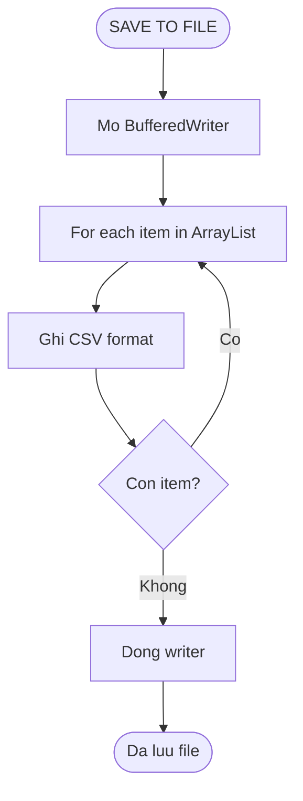
```mermaid
flowchart TD
    A([SAVE TO FILE]) --> B[Mo BufferedWriter]
    B --> C[For each item in ArrayList]
    C --> D[Ghi CSV format]
    D --> E{Con item?}
    E -->|Co| C
    E -->|Khong| F[Dong writer]
    F --> G([Da luu file])
```

### 17.2 Load from File

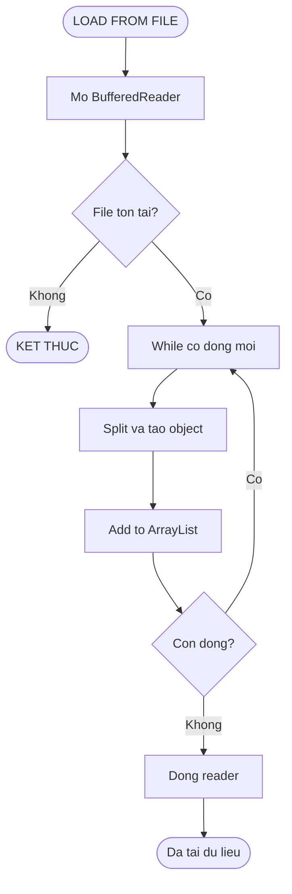
```mermaid
flowchart TD
    A([LOAD FROM FILE]) --> B[Mo BufferedReader]
    B --> C{File ton tai?}
    C -->|Khong| D([KET THUC])
    C -->|Co| E[While co dong moi]
    E --> F[Split va tao object]
    F --> G[Add to ArrayList]
    G --> H{Con dong?}
    H -->|Co| E
    H -->|Khong| I[Dong reader]
    I --> J([Da tai du lieu])
```

---

## Tổng Kết

| # | Flowchart | Mô tả |
|---|-----------|-------|
| 1 | Tổng quan | Luồng chính |
| 2 | Đăng nhập | Xác thực |
| 3 | Đăng ký | Tạo TK mới |
| 4 | CRUD | Thêm/Sửa/Xóa |
| 5 | Đổi MK | Thay đổi MK |
| 6 | Xuất CSV | Tạo báo cáo |
| 7 | Tính điểm | Công thức |
| 8 | QL Sinh viên | CRUD SV |
| 9 | QL Giảng viên | CRUD GV |
| 10 | QL Môn học | CRUD môn |
| 11 | QL Lớp học | CRUD lớp |
| 12 | Đăng ký môn | CRUD enrollment |
| 13 | Điểm danh | CRUD attendance |
| 14 | QL Khoa | CRUD department |
| 15 | QL Học kỳ | CRUD semester |
| 16 | Thống kê | Báo cáo |
| 17 | Lưu/Đọc file | Persistence |
