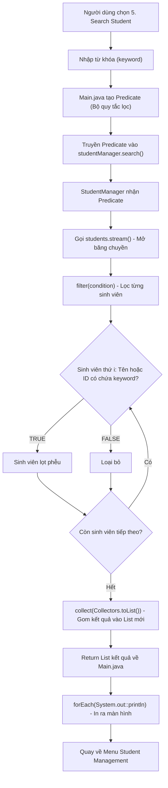
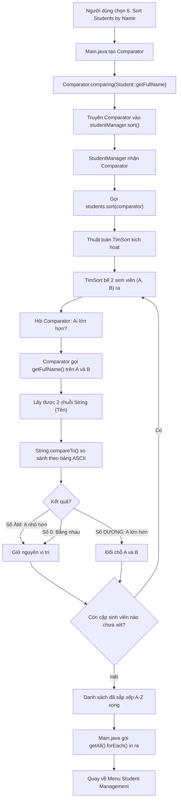
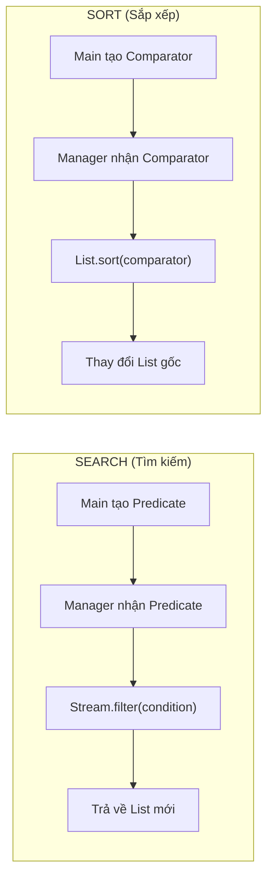

# Flowchart: Search & Sort Chi Tiết

## 1. Luồng Tìm Kiếm (Search Flow)

### Giải thích:
- **Predicate** được tạo ở `Main.java`, truyền vào `StudentManager` (giống Comparator của Sort)
- **Stream API** mở băng chuyền dữ liệu, lọc từng sinh viên qua phễu `filter`
- Kết quả được gom vào **List mới** (không thay đổi danh sách gốc)
- **toLowerCase()** được gọi ở cả 2 phía (Tên sinh viên + Từ khóa) để tìm kiếm không phân biệt Hoa/Thường

---

## 2. Luồng Sắp Xếp (Sort Flow)

### Giải thích:
- **Comparator** được tạo ở `Main.java`, truyền vào `StudentManager`
- `StudentManager` hoàn toàn **mù tịt** về tiêu chí sắp xếp (Open/Closed Principle)
- **TimSort** (thuật toán có sẵn của Java) thực hiện việc đổi chỗ
- **String.compareTo()** (phương thức có sẵn của String) thực hiện việc so sánh tên
- Muốn đổi tiêu chí (xếp theo ID, Lớp...) → Chỉ sửa ở `Main.java`, không đụng `StudentManager`

---

## 3. So sánh Search vs Sort

### Điểm giống nhau:
- Cả 2 đều **truyền hành vi (Behavior)** từ Main vào Manager
- Manager đều **mù tịt** về logic bên trong
- Muốn thay đổi tiêu chí → Chỉ sửa ở Main, không đụng Manager

### Điểm khác nhau:
| | Search | Sort |
|---|---|---|
| Dùng gì | `Predicate<T>` (Bộ lọc) | `Comparator<T>` (Bộ so sánh) |
| Trả về | `true/false` (Lọt hay không) | Số Âm/0/Dương (Ai lớn hơn) |
| Kết quả | List **MỚI** (không đụng gốc) | Thay đổi List **GỐC** |
