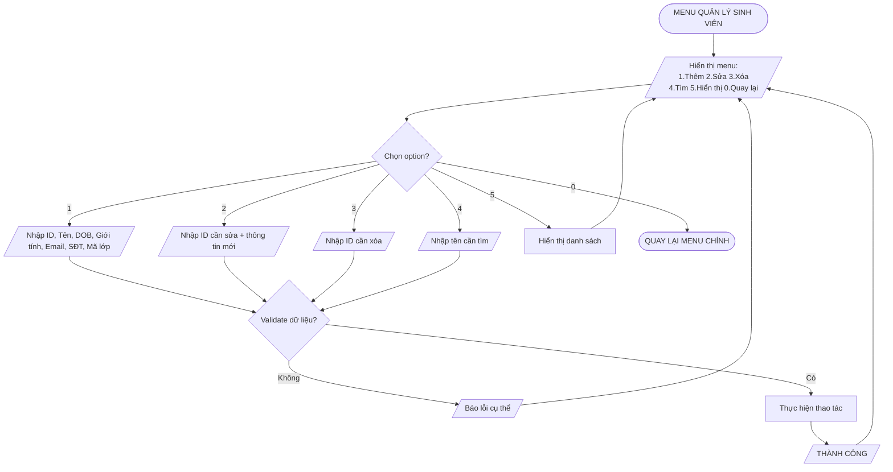
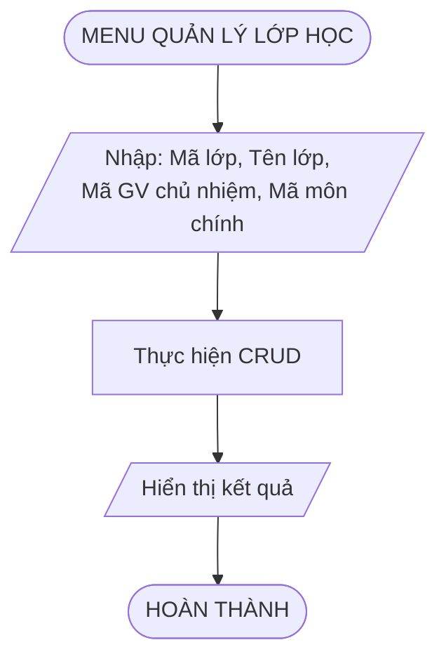
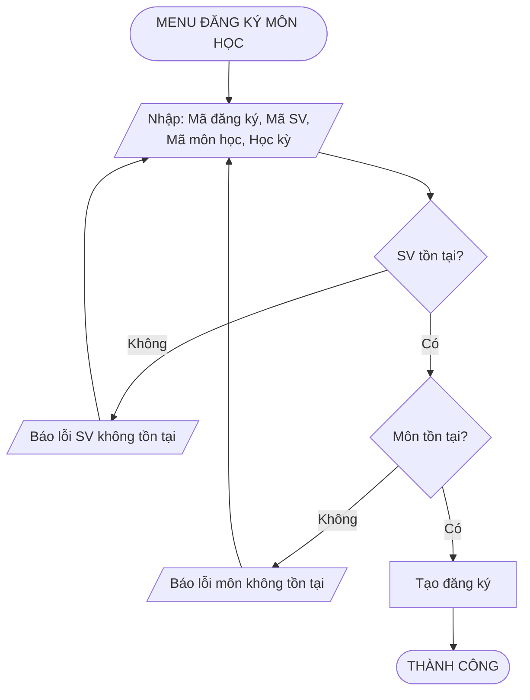
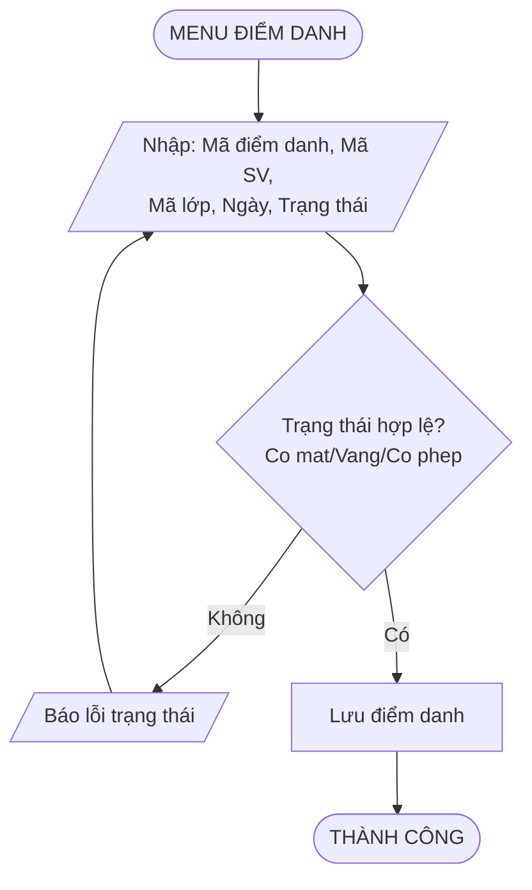
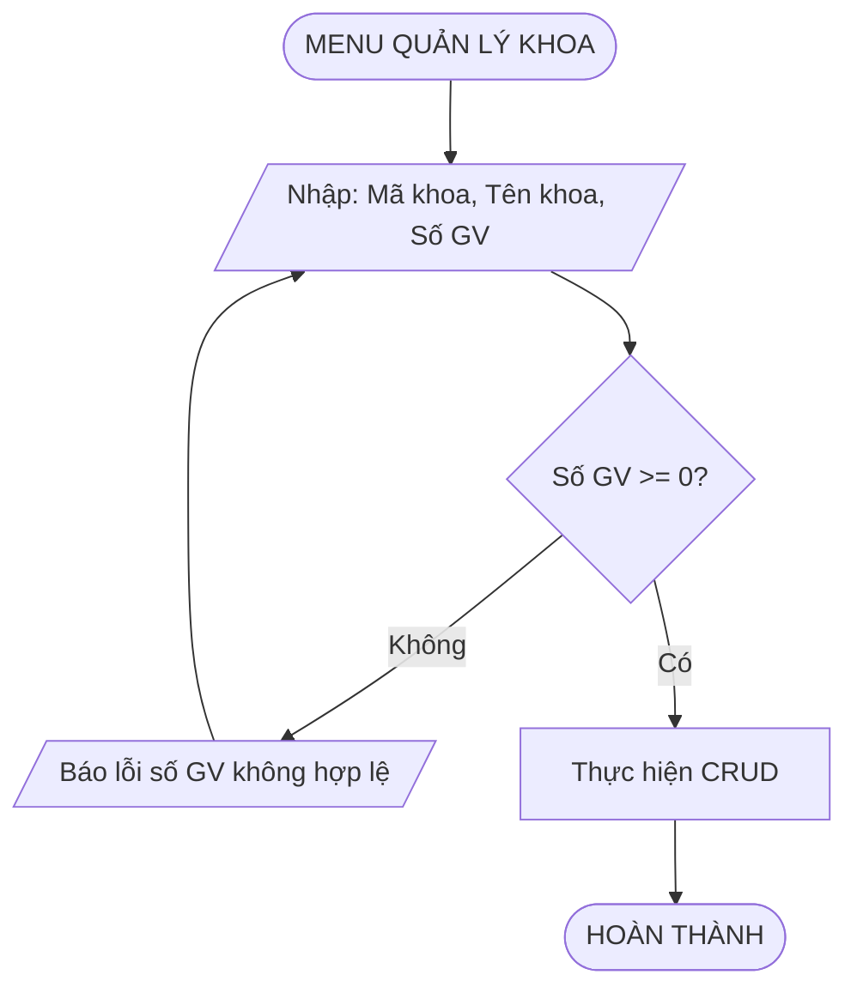
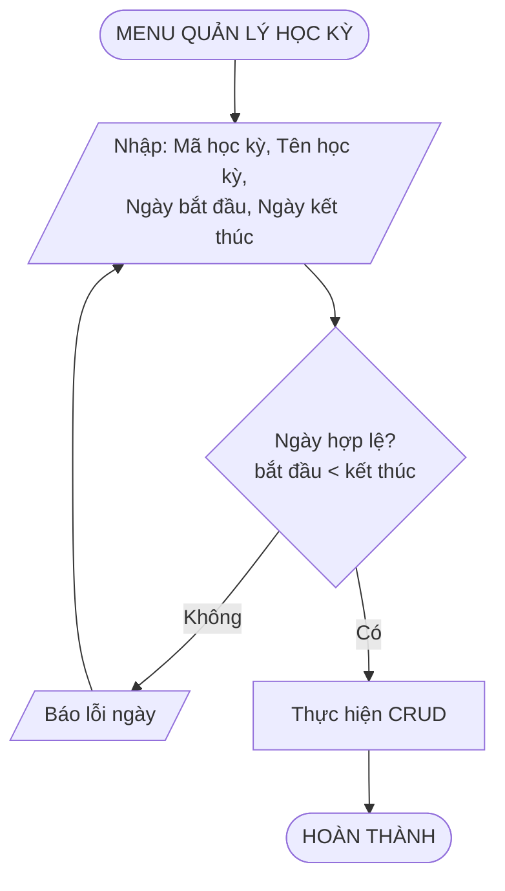
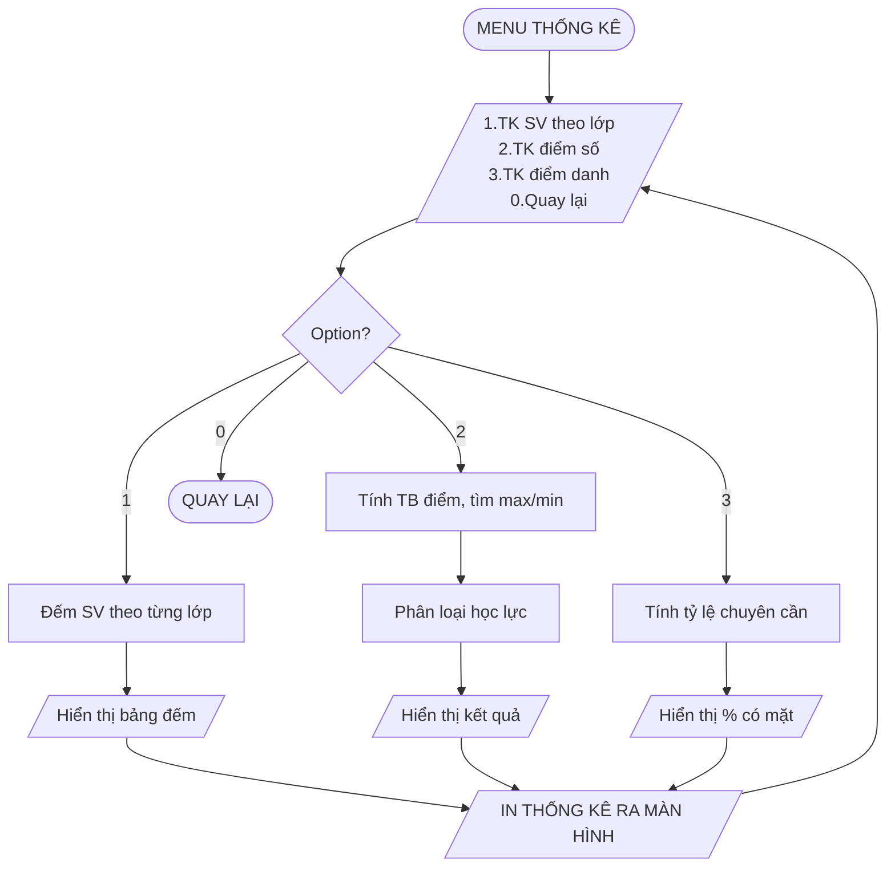

## 8. Flowchart Quản Lý Sinh Viên

---

## 9. Flowchart Quản Lý Giảng Viên

---

## 10. Flowchart Quản Lý Môn Học

---

## 11. Flowchart Quản Lý Lớp Học

---

## 12. Flowchart Quản Lý Đăng Ký Môn

---

## 13. Flowchart Quản Lý Điểm Danh

---

## 14. Flowchart Quản Lý Khoa

---

## 15. Flowchart Quản Lý Học Kỳ

---

## 16. Flowchart Thống Kê

---
