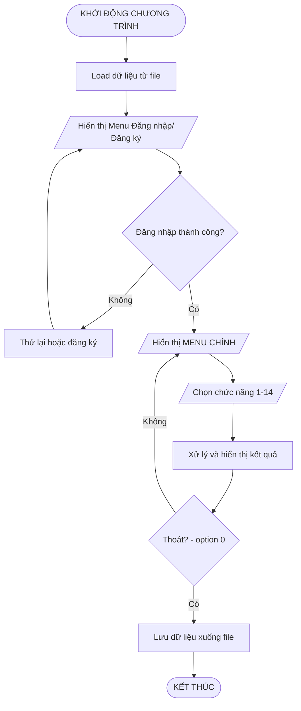

# Flowcharts - Sơ Đồ Luồng Hệ Thống

> **Chú thích các hình dạng chuẩn:**
> - `([...])` = Hình bầu dục → Bắt đầu/Kết thúc
> - `[...]` = Hình chữ nhật → Xử lý/Thao tác
> - `[/.../ ]` = Hình bình hành → Nhập/Xuất dữ liệu
> - `{...}` = Hình thoi → Điều kiện rẽ nhánh

---

## 1. Flowchart Tổng Quan Hệ Thống

---

