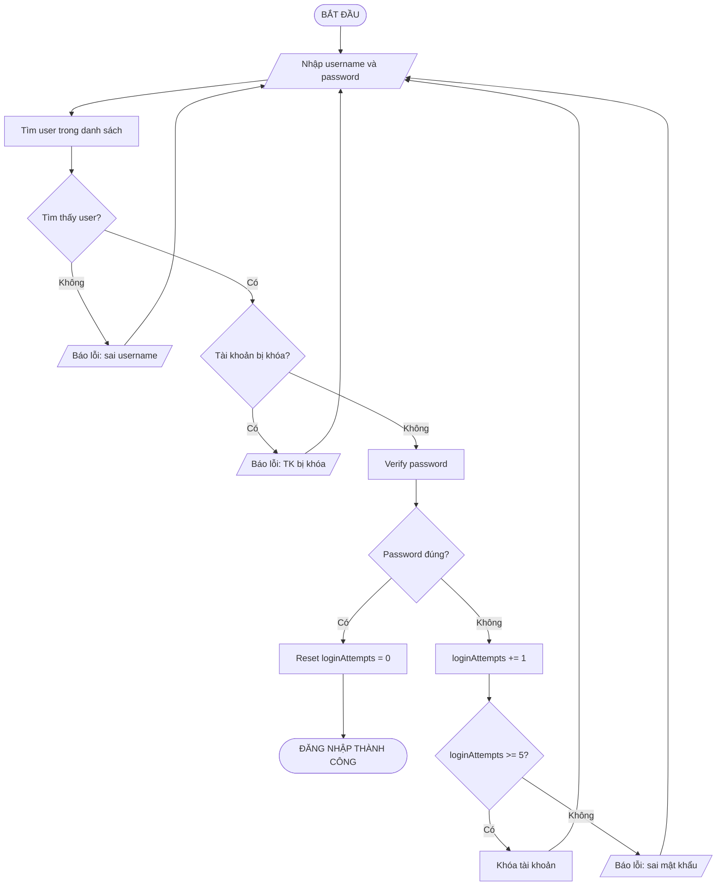
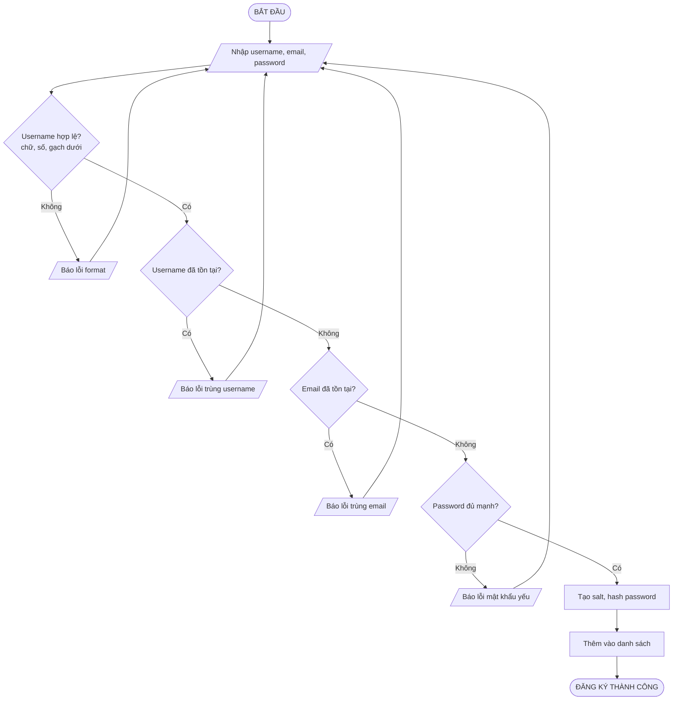
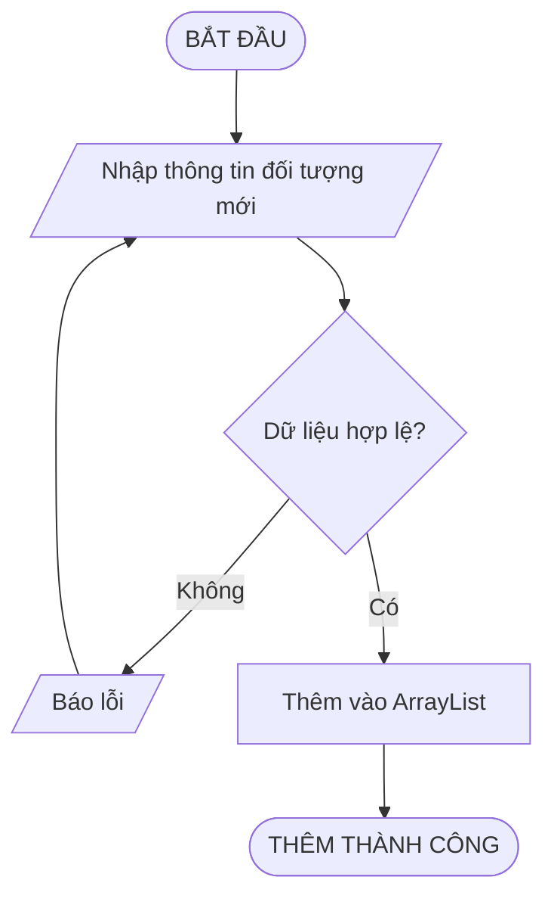
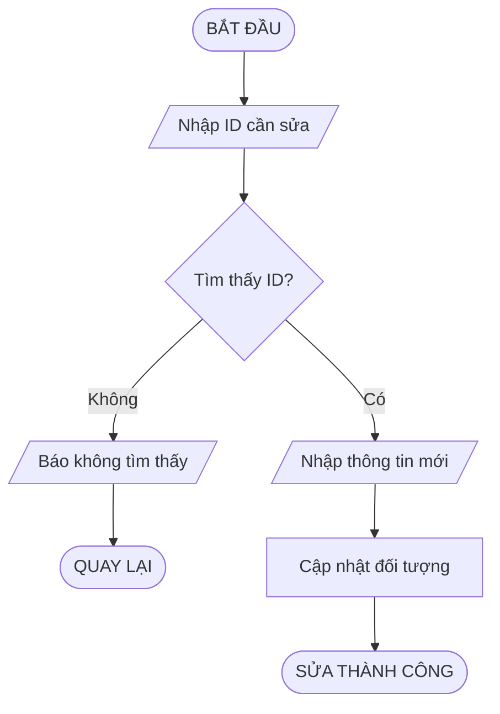
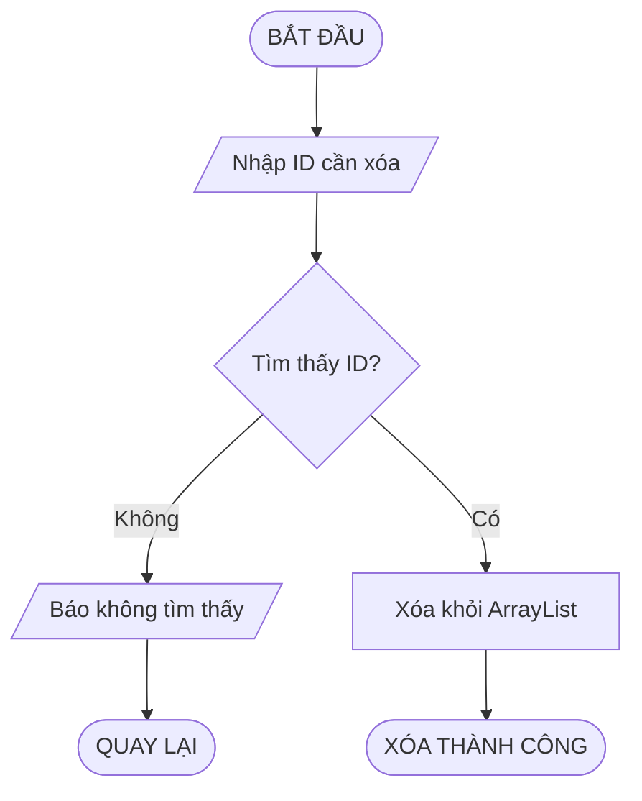
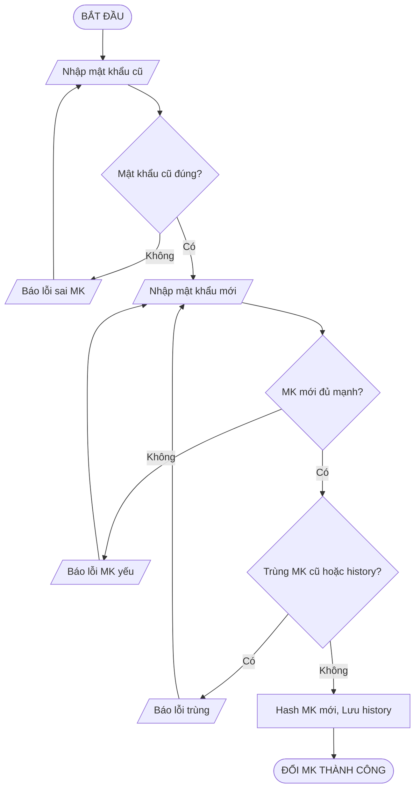
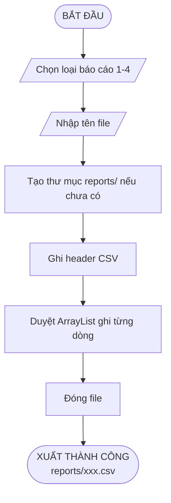
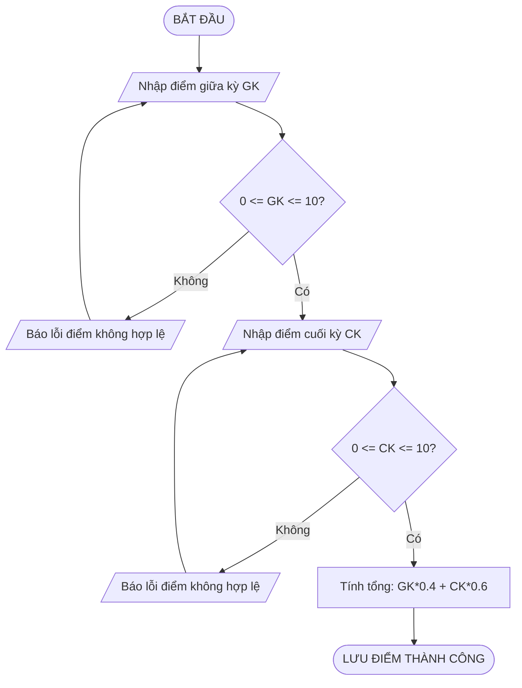
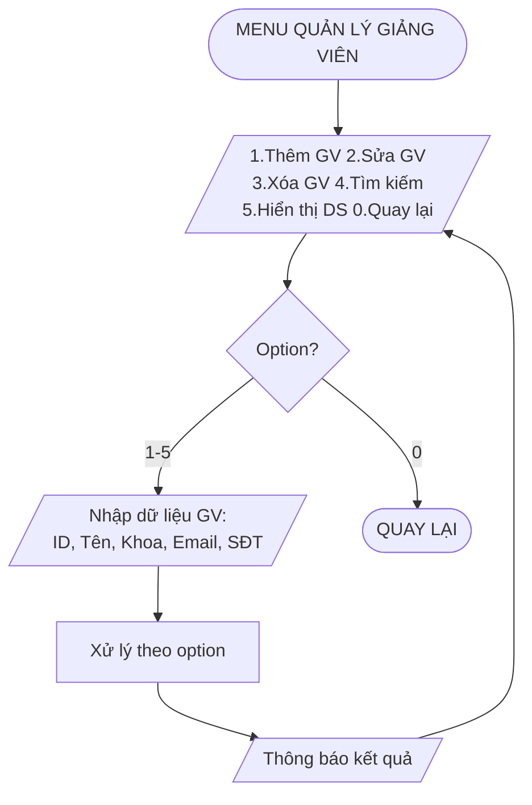
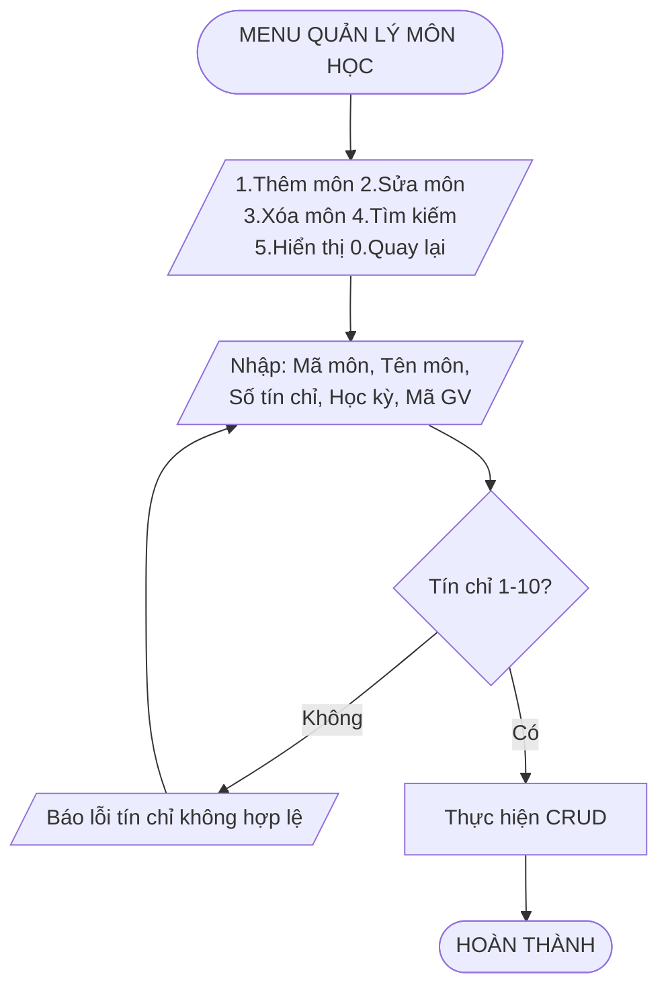

# Flowcharts - Sơ Đồ Luồng Hệ Thống

> **Chú thích các hình dạng chuẩn:**
> - `([...])` = Hình bầu dục → Bắt đầu/Kết thúc
> - `[...]` = Hình chữ nhật → Xử lý/Thao tác
> - `[/.../ ]` = Hình bình hành → Nhập/Xuất dữ liệu
> - `{...}` = Hình thoi → Điều kiện rẽ nhánh

## 2. Flowchart Đăng Nhập

---

## 3. Flowchart Đăng Ký Tài Khoản

---

## 4. Flowchart CRUD

### 4.1 Thêm mới (Add)

### 4.2 Sửa (Update)

### 4.3 Xóa (Delete)

---

## 5. Flowchart Đổi Mật Khẩu

---

## 6. Flowchart Xuất Báo Cáo CSV

---

## 7. Flowchart Tính Điểm Tổng

---

## 8. Flowchart Quản Lý Sinh Viên

---

## 9. Flowchart Quản Lý Giảng Viên

---

## 10. Flowchart Quản Lý Môn Học

---

## 11. Flowchart Quản Lý Lớp Học

---

